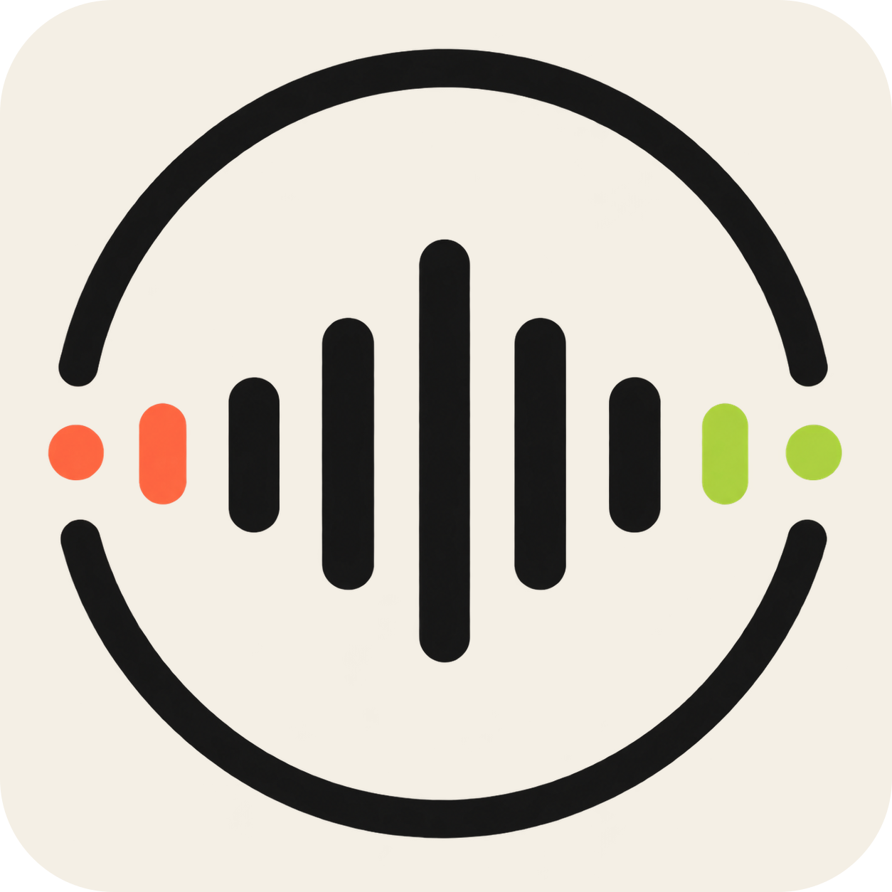

  

# Concierge for Codex

## Give Codex a phone

Concierge lets Codex answer calls, make calls for you, and continue work after
you hang up.

It can call you when work is done or when it needs a quick answer. It can also
handle a personal call, such as booking an appointment or asking a business a
question.

The beta supports Codex phone calls in the United States, one live call at a time.

## Before you install

Start at [dialconcierge.com](https://dialconcierge.com). Create an account or
sign in, then follow the account setup steps.

This beta requires a Mac with Apple silicon, macOS 13 or later, and Codex
0.146.0-alpha.3.1 or later. Windows, Linux, and Intel Macs are not supported.

Check [availability](https://dialconcierge.com/docs/availability) before installing.

## Install

Use this repository's GitHub address as the marketplace source in Codex.
The [install guide](plugins/concierge/PUBLIC_INSTALL.md) shows how to add it
and install Concierge.

With Concierge installed and active, enable its hooks and
say "Connect this computer" in Codex. The plugin installs its included
computer helper and opens browser approval. Sign in with your Concierge
account, approve the connection, and check that your computer is ready.

## Updates

Follow the [update steps](plugins/concierge/PUBLIC_INSTALL.md#updates) to refresh
this marketplace and install a newer release. Start a new Codex task after an
update. Check your connected computer before you use phone calls.

## Links

[Docs](https://dialconcierge.com/docs) ·
[Support](https://dialconcierge.com/support) ·
[Privacy](https://dialconcierge.com/privacy) ·
[Terms](https://dialconcierge.com/terms)

Concierge is proprietary software owned by SEA & SEA LLC. You may install and
use this package with a Concierge account and a supported Codex installation
under the [Terms of Service](https://dialconcierge.com/terms). See the
[proprietary notice](plugins/concierge/LICENSE.md).
